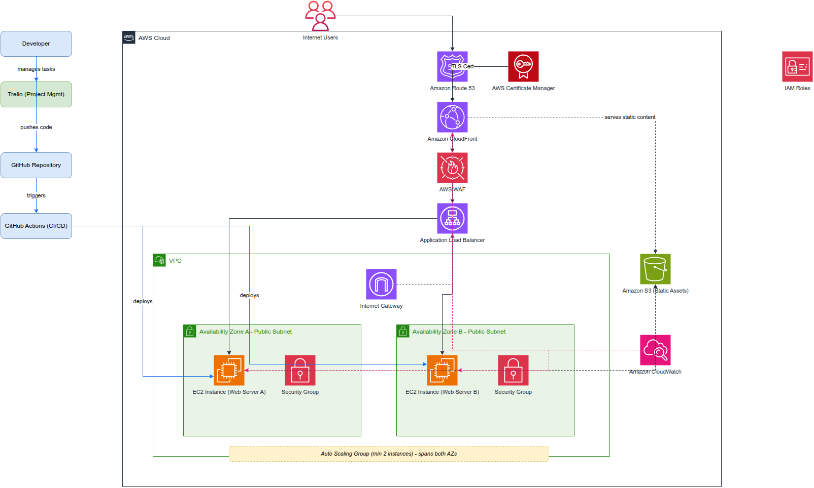

<div align="center">

#  End-to-End Cloud Solution Design & Deployment

### Team TomCat 🐱

Designing and deploying a secure, scalable, and highly available cloud solution on AWS for **FreshBite Kitchen**.


</div>

---

## Project Overview

This repository is part of our AWS Cloud Engineering internship, where **Team TomCat** designs, architects, and deploys a production-inspired web application on AWS.

The solution is built to deliver:

- **High availability** across multiple Availability Zones
- **Security** through IAM least-privilege access and HTTPS-only traffic
- **Scalability** using load-balanced, horizontally-scalable compute
- **Performance** via a global CDN
- **Cost efficiency** by staying within the AWS Free Tier

---

## Customer Problem

Ember & Root, a fast-growing food service startup, launched a web application but is running into:

- Slow page load times
- Inconsistent availability during peak traffic
- Security concerns around the current setup
- A manual, error-prone deployment process
- Difficult collaboration between developers

Our goal is to redesign their infrastructure on AWS — secure, highly available, and scalable — while staying within the Free Tier.

---

##  Proposed Solution

Team TomCat is implementing an end-to-end AWS architecture using:

- Amazon EC2
- Amazon S3
- Amazon CloudFront
- Application Load Balancer (ALB)
- AWS Certificate Manager (ACM)
- AWS IAM
- GitHub & GitHub Actions
- Trello

Together, these improve performance, security, collaboration, and deployment automation for FreshBite Kitchen.

---

##  Solution Architecture

Our architecture provides a **secure, scalable, highly available, and fault-tolerant** infrastructure for FreshBite Kitchen. It spans multiple AWS services to ensure fast content delivery, secure communication, automated deployments, and resilience across Availability Zones.

<div align="center">

### AWS Infrastructure Architecture



</div>

### Key Components

| Service | Role |
|---|---|
|  Amazon Route 53 | Routes customer requests to the application |
|  AWS Certificate Manager (ACM) | Issues SSL/TLS certificates for HTTPS |
|  Amazon CloudFront | Global CDN for low-latency content delivery |
|  AWS WAF | Protects against common web exploits and malicious traffic |
|  Application Load Balancer | Distributes traffic across healthy EC2 instances |
|  Amazon EC2 | Hosts the FreshBite web application |
|  Amazon S3 | Stores static assets (images, CSS, JS) |
|  Amazon CloudWatch | Monitors application health, logs, and metrics |
|  IAM Roles | Manages permissions securely between services |
|  GitHub Actions | Automates deployment from GitHub to AWS |
|  Trello | Tracks project tasks and team collaboration |

### High Availability

The application is deployed across **two Availability Zones** using multiple EC2 instances behind an **Application Load Balancer**, providing redundancy and minimizing downtime.

### Deployment Workflow

```text
Developer
    │
    ▼
GitHub Repository
    │
    ▼
GitHub Actions (CI/CD)
    │
    ▼
Amazon EC2 (Auto Scaling Group)
```

This lets FreshBite Kitchen scale efficiently while maintaining security, availability, and reliable, repeatable deployments.

---

## Technology Stack

| Category | Technology |
|---|---|
| Cloud Provider | AWS |
| Compute | Amazon EC2 |
| Storage | Amazon S3 |
| CDN | Amazon CloudFront |
| Load Balancer | Application Load Balancer |
| Security | IAM, ACM |
| Version Control | Git & GitHub |
| CI/CD | GitHub Actions |
| Project Management | Trello |

---

##  Project Milestones

###  Milestone 1 — Project Setup & Environment Configuration

**Objective:** Prepare the cloud environment, development tools, and repositories.

- AWS Free Tier account
- IAM users with least-privilege permissions
- AWS CLI configured with named profiles
- GitHub repository with branching strategy
- Trello board set up
- EC2 instance launched
- S3 bucket created
- ACM certificate requested
- README documentation

###  Milestone 2 — Web Application Deployment

**Objective:** Deploy a secure web application behind an Application Load Balancer.

- Build the web application
- Deploy to EC2
- Configure Target Group
- Configure Application Load Balancer
- HTTP → HTTPS redirect
- Upload static assets to S3
- Test ALB health checks
- Track progress in Trello

---

##  Project Progress

| Milestone | Status |
|---|:---:|
| Phase 1 – Environment Setup |  Complete |
| Phase 2 – Web Application |  In Progress |
| CloudFront Configuration | Pending |
| HTTPS Configuration |  Pending |
| GitHub Actions CI/CD |  Pending |

---

##  Git Workflow

```text
main
 │
 └── develop
        │
        ├── feature/setup
        ├── feature/ec2
        ├── feature/s3
        ├── feature/alb
        ├── feature/cloudfront
        └── feature/github-actions
```

---

##  Repository Structure

```text
.
├── docs
├── screenshots
├── src
├── index.html
├── README.md
└── .gitignore
```

---

##  Team TomCat

| Member | Responsibility |
|---|---|
| David Quayartey | Team Lead / Coordinator |
| Emmanuel Akatse | AWS Admin |
| Samuel Kinsford Amoah | GitHub Manager |
| Peter Nartey | Infrastructure Engineer |
| Nunoo Annah Frimpomaah | Security & Docs Lead |

| Nunoo Annah Frimpomaah | Security & Docs Lead |
| Peter Nartey | Infrastructure Engineer |
| Emmanuel Akatse | AWS Admin |
| Samuel Kingsford Amoah | GitHub Manager |
| David Quayartey | Coordinator|

---

##  Screenshots

| Environment | Preview |
|---|---|
| EC2 Instance | _Coming soon_ |
| S3 Bucket | _Coming soon_ |
| ALB | _Coming soon_ |
| CloudFront | _Coming soon_ |
| Final Deployment | _Coming soon_ |

---

##  Learning Objectives

Through this project, the team is building hands-on experience in:

- Cloud architecture design
- AWS networking
- High availability patterns
- Load balancing
- Content delivery networks (CDN)
- Infrastructure security
- Git workflow / branching strategy
- CI/CD pipelines
- Team collaboration on shared infrastructure

---

##  References

- [Amazon CloudFront Documentation](https://docs.aws.amazon.com/cloudfront)
- [Application Load Balancer Documentation](https://docs.aws.amazon.com/elasticloadbalancing)
- [Amazon EC2 Documentation](https://docs.aws.amazon.com/ec2)
- [AWS Certificate Manager Documentation](https://docs.aws.amazon.com/acm)
- [AWS IAM Documentation](https://docs.aws.amazon.com/iam)
- [Amazon S3 Documentation](https://docs.aws.amazon.com/s3)
- [GitHub Actions Documentation](https://docs.github.com/en/actions)
- [Trello Guide](https://trello.com/guide)
- [AWS Budgets — Managing Costs](https://docs.aws.amazon.com/awsaccountbilling/latest/aboutv2/budgets-managing-costs.html)
- [AWS Free Tier](https://aws.amazon.com/free)

---

<div align="center">

##  Team TomCat

*"Building secure cloud solutions through collaboration and continuous learning."*

</div>
